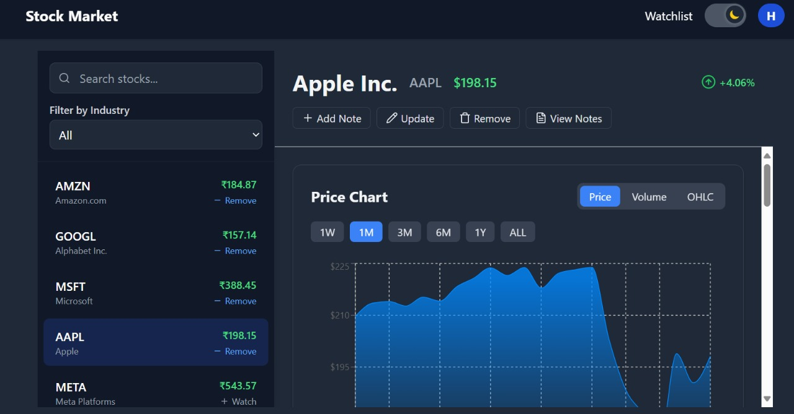
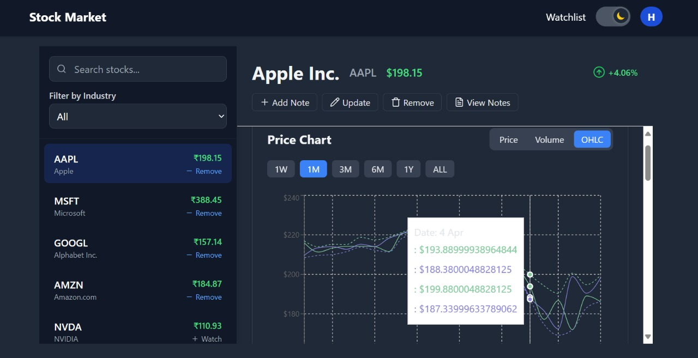
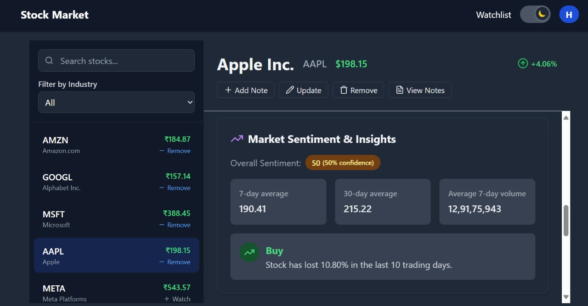
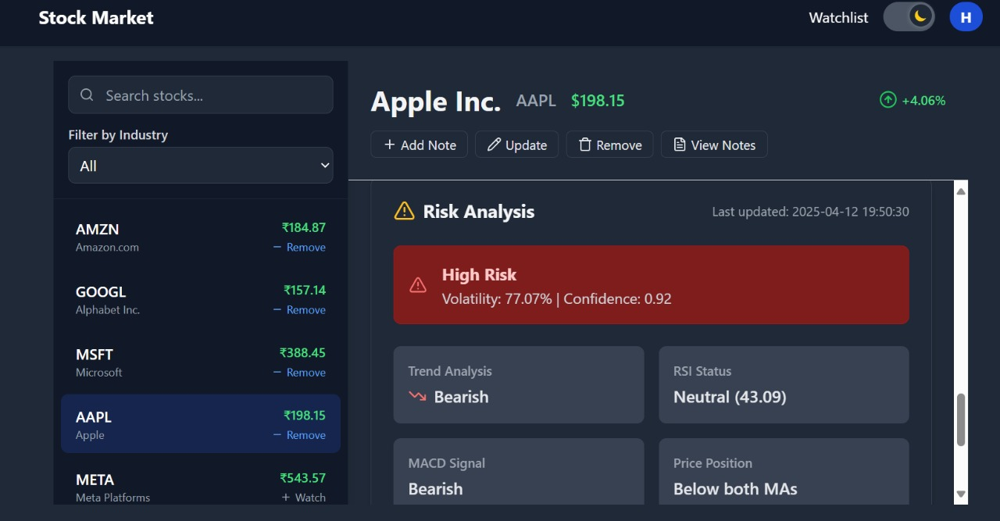
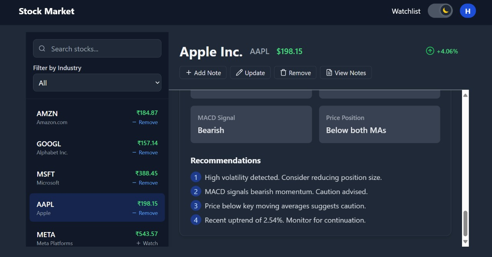
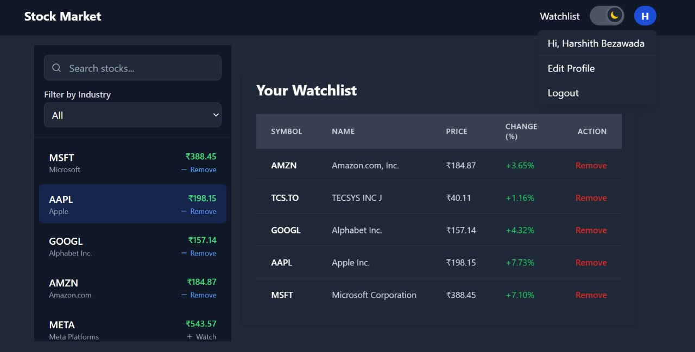

# 📈 Stock Market Analysis & Prediction Platform

An intelligent stock market analysis platform built using **Node.js**, **Express.js**, **React.js**, and **Python** for risk analysis and prediction. It fetches real-time stock data, analyzes it using technical indicators, and visualizes trends with interactive charts. The system also integrates sentiment analysis from financial news to give **buy/sell signals** and provides a **personalized watchlist** feature.

---

## 🚀 Features

- 🔍 **Search & Explore Stocks**  
  - Search for any stock using ticker symbols (e.g., AAPL, TSLA).
  - View real-time data including price, volume, highs/lows, and more using **Yahoo Finance** and **Financial Modeling Prep API**.

- 📈 **Visual Trends & Insights**  
  - Display historical trends with interactive charts using **Recharts**.
  - Technical indicators like RSI, MACD, and Moving Averages via **pandas_ta**.

- 🧠 **AI-Powered Analysis**  
  - Python-based backend scripts perform:
    - Risk analysis based on volatility and trends.
    - Price prediction using recent data.

- 📰 **Sentiment-Based Buy Signals**  
  - Analyze financial headlines using **News API**.
  - Determine market sentiment and suggest buy/sell actions.

- ⭐ **Watchlist Feature**  
  - Add favorite stocks to a personal watchlist.
  - Easily monitor and revisit preferred stocks.

---

## 🛠 Tech Stack

| Layer       | Tools & Libraries                                         |
|-------------|-----------------------------------------------------------|
| **Frontend** | React.js, Tailwind CSS, Axios, Recharts                  |
| **Backend**  | Node.js, Express.js, MongoDB                             |
| **APIs**     | Yahoo Finance, Financial Modeling Prep, News API         |
| **AI Tools** | Python, yfinance, pandas, pandas-ta, numpy               |

---

## ⚙️ Installation & Setup

### 🔧 Backend Setup (Node.js)

```bash
cd backend
npm install
npm run dev
```


### 🌐 Frontend Setup (React)

```bash
cd frontend
npm install
npm start
```

App runs at: `http://localhost:3000`

### 🧠 Python AI Scripts

Install Python dependencies:

```bash
pip install yfinance pandas pandas-ta numpy flask python-dotenv
```

Run analysis:

```bash
python risk_analysis.py
python prediction_analysis.py
```

---

## 📸 Snapshots

### 🔍 Loginpage


### 🔍 Homepage with Search & Insights  


### 📈 Stock Trend Chart  


### 🧠 AI Prediction Output  




### ⭐ Watchlist Feature  


---

## 🤝 Contributors

- [Harshith Bezawada](https://github.com/Harshith20B)
- [Akash](https://github.com/anayakgit)
- [Ajay Nayak](https://github.com/username3)
- [Abhyudaya Singh](https://github.com/Drotum)

---

## 📃 License

This project is licensed under the **MIT License**. Feel free to use, modify, and share!
